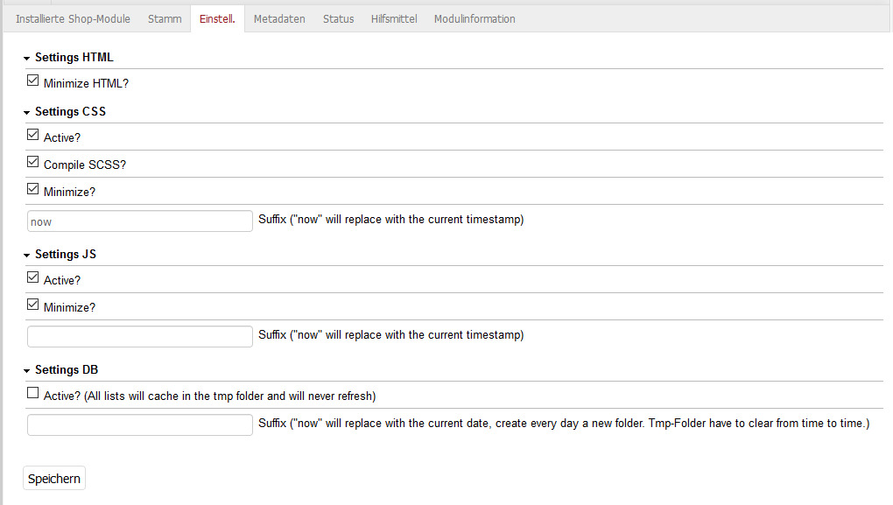

# Oxid optimize

## Description

Minimize HTML.

JS, CSS files will cache by compile (scss) and minimize them 
and save in the same folder with a different filename. If the 
suffix is "now" it will use the current timestamp and at 
every page call the file will recreate. After some time, there
are many files.

The DB cache save all sql statments made by the list model. It 
will save in the tmp folder. If you use the suffix "now" it 
will create a new folder for every day. After some time, there
can be many folders.

This extension was created for Oxid 6.x.

## Install

1. Add following to composer.json on the shop root

        "autoload": {
            "psr-4": {
                "rs\\optimize\\": "./source/modules/rs/optimize"
            }
        },
    
2. Refresh autoloader files with composer.

        composer dump-autoload
        
3. Enable module in the oxid admin area, Extensions => Modules
4. Changes settings in the module itself

## Manual optimization

Add to .htaccess under RewriteBase...

    #cpOptimization module start
    <IfModule mod_deflate.c>
        AddOutputFilterByType DEFLATE text/html
        AddOutputFilterByType DEFLATE text/css
        AddOutputFilterByType DEFLATE text/javascript
        AddOutputFilterByType DEFLATE application/javascript
        AddOutputFilterByType DEFLATE application/x-javascript
    </IfModule>
    <FilesMatch ".(js|css|html|htm|php|xml)$">
        SetOutputFilter DEFLATE
    </FilesMatch>
    <IfModule mod_expires.c>
        ExpiresActive on
        ExpiresDefault "access plus 24 hours"
        ExpiresByType image/jpg "access plus 1 month"
        ExpiresByType image/gif "access plus 1 month"
        ExpiresByType image/jpeg "access plus 1 month"
        ExpiresByType image/png "access plus 1 month"
        ExpiresByType image/x-icon "access plus 1 month"
        ExpiresByType text/css "access plus 1 month"
        ExpiresByType text/javascript "access plus 1 month"
        ExpiresByType application/javascript "access plus 1 month"
        ExpiresByType application/x-shockwave-flash "access plus 1 month"
    </IfModule>
    <IfModule mod_headers.c>
        <filesmatch "\\.(ico|jpe?g|png|gif|swf)$">
            Header set Cache-Control "max-age=2592000, public"
        </filesmatch>
        <filesmatch "\\.(css)$">
            Header set Cache-Control "max-age=604800, public"
        </filesmatch>
        <filesmatch "\\.(js)$">
            Header set Cache-Control "max-age=216000, private"
        </filesmatch>
    </IfModule>
    #cpOptimization module end
    